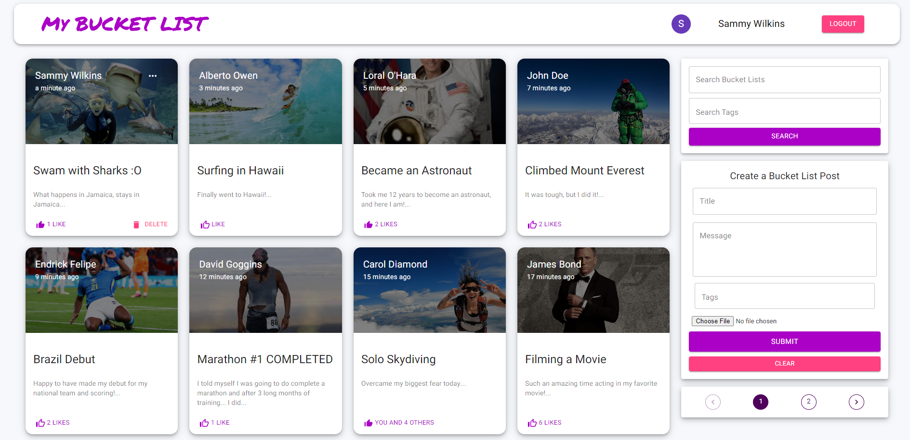
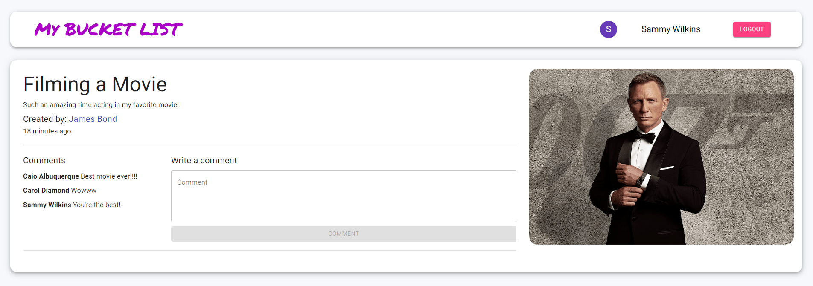

# Base Page with Create/Edit Post and Seach Components

# Post Page with Comments

# MyBucketList Application Explanation  
Social Media Mock Application to allow users to post their bucket lists

# Technology Stack
MERN (MongoDB, Express.js, React, Node.js), Google Identity Services, Axios, JWT, Bcrypt, Morgan, Helmet, bodyParser, MUI Styling

# Time Spent
June 12, 2024 - August 16, 2024

# Notice
Accidentally built the application on Node.js version 16, thus to launch the app you will need to use the legacy-provider commands

# App Launch on Windows Powershell
cd server  
nodemon index.js  

cd client  
set NODE_OPTIONS=--openssl-legacy-provider  
$env:NODE_OPTIONS="--openssl-legacy-provider    
npm start

